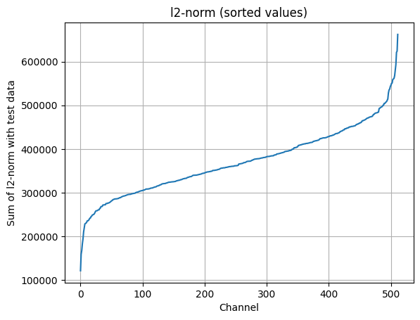

Compact Image Style Transfer
==

**Unofficial PyTorch implementation of "Compact Image Style Transfer: Channel Pruning on a Single Training of Network"**

**Reference**
* Uncorrelated feature encoding for faster image style transfer
* Compact Image Style Transfer: Channel Pruning on a Single Training of Network


## Intro.
> This method automatically finds a number of consistently inactive convolution channels during the network training phase by using two new losses, i.e., channel loss and xor loss. The former maximizes the number of inactive channels and the latter fixes the positions of these inactive channels to be the same for the image.


## Usage
* Content Dataset: MSCOCO 2014 train/test
* Style Dataset: Painter by numbers train/test
* Trained Model Weights: [Link](https://github.com/tyui592/compact_image_style_transfer/releases/tag/v1.0)
* Requirements
  - torch
  - torchvision
  - wandb

### Example Scripts
```bash
content=/path/to/content/dataset/
style=/path/to/style/dataset/

# W/ Channel and XOR Losses
python main.py --mode 'train' --backbone 'vgg19' \
    --imsize 512 --cropsize 256 --content_dir ${content} \
    --style_dir ${style} --batch_size 4 --check_iter 100 \
    --style_loss_weight 100.0 --uncorrelation_loss_weight 0.0 \
    --channel_loss_weight 10000.0 --xor_loss_weight 500.0 \
    --save_path "./model-store/ch_xor" --encoder_lr 5e-6 \
    --max_iter 80000 --style_loss "meanstd" \
    --wb_project "compact_image_style_transfer" \
    --wb_name "ch_xor" --wb_tags "channel loss" "xor loss" \
    --wb_notes "Model training with content/style/ch/xor loss"

# Baseline Model
python main.py --mode 'train' --backbone 'vgg19' \
    --imsize 512 --cropsize 256 --content_dir ${content} \
    --style_dir ${style} --batch_size 4 --check_iter 100 \
    --style_loss_weight 100.0 --uncorrelation_loss_weight 0.0 \
    --channel_loss_weight 0.0 --xor_loss_weight 0.0 \
    --save_path "./model-store/baseline" --encoder_lr 0 \
    --max_iter 80000 --style_loss "meanstd" \
    --wb_project "compact_image_style_transfer" \
    --wb_name "baseline" --wb_tags "baseline" \
    --wb_notes "Model training with content/style loss"

# W/ Uncorrelation Loss
python main.py --mode 'train' --backbone 'vgg19' \
    --imsize 512 --cropsize 256 --content_dir ${content} \
    --style_dir ${style} --batch_size 4 --check_iter 100 \
    --style_loss_weight 100.0 --uncorrelation_loss_weight 50.0 \
    --channel_loss_weight 0.0 --xor_loss_weight 0.0 \
    --save_path "./model-store/uncorrelation" --encoder_lr 5e-6 \
    --max_iter 80000 --style_loss "meanstd" \
    --wb_project "compact_image_style_transfer" \
    --wb_name "uncorrelation" --wb_tags "uncorrelation" \
    --wb_notes "Model training with content/style loss"
```


## Result
**The results below were generated in jupyter notebook.**

### $l_0$-norm per image
* Channel response (white: nonzero response, black: zero response) of encoded feature map per image.

| baseline | w/ uncorrelation loss | w/ channel & xor loss |
| --- | --- | --- |
|  |  | |

*The result of pretrained vgg encoder(baseline) has no zero response, and if uncorrelation loss is used, zero response comes out, but the position changes depending on the image. However, using channel loss and xor loss results in consistent zero response for the same channel.*


### Pruning Result
For channel pruning, channels were sorted in order of the magnitude of the l2-norm for the test data, and prunings were performed sequentially starting with the smallest value.

**baseline**
| Sorted Channel Magnitude(l2-norm) | Pruning Results | 
| --- | --- |
|  |  |

**w/ channel & xor losses**
| Sorted Channel Magnitude(l2-norm) | Pruning Results | 
| --- | --- |
|  |  |